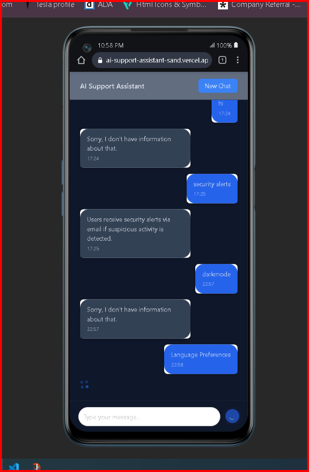
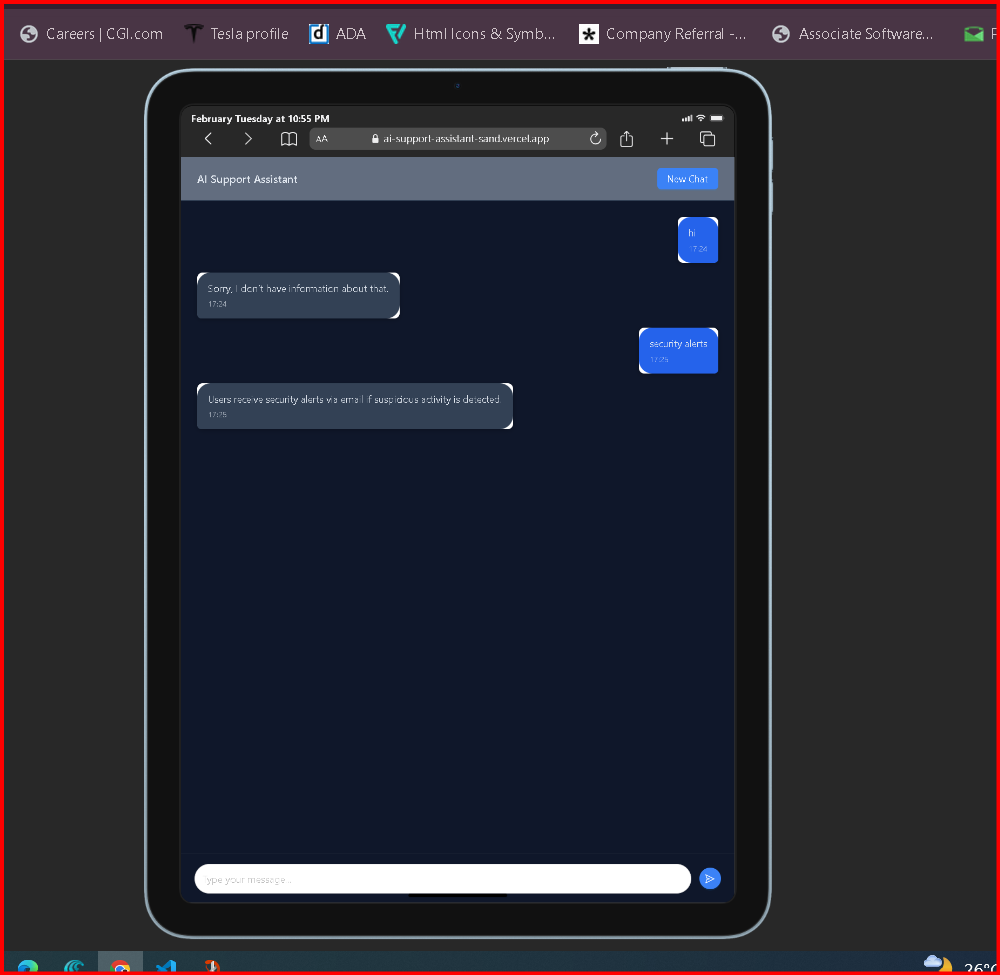
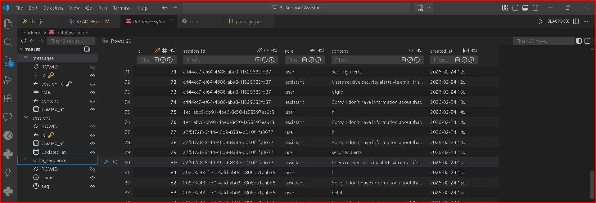

📘 AI-Powered Support Assistant
🧪 Weitredge Assignment – Full Stack Application

A full-stack AI-powered Support Assistant built using:

Frontend: React.js (Vite + Ant Design)

Backend: Node.js + Express

Database: SQLite

LLM Provider: OpenRouter (Mistral/OpenAI compatible)

The assistant answers only from product documentation (docs.json), maintains session-based memory, and stores conversations in SQLite.

If information is not found in documentation, it responds:

“Sorry, I don’t have information about that.”

📂 Project Structure
```bash
AI-Support-Assistant/
│
├── backend/
│ │
│ ├── node_modules/ # Installed backend dependencies
│ │
│ ├── routes/
│ │ └── chat.js # All API endpoints (chat, conversations, sessions)
│ │
│ ├── database.sqlite # SQLite database file (auto-created)
│ ├── db.js # SQLite connection + table creation
│ ├── docs.json # Product documentation (FAQ source)
│ ├── server.js # Express server entry point
│ │
│ ├── .env # Backend environment variables
│ ├── .gitignore
│ ├── package.json
│ └── package-lock.json
│
├── frontend/
│ │
│ ├── node_modules/ # Installed frontend dependencies
│ │
│ ├── public/ # Static assets
│ │
│ ├── src/
| | |
│ │ │
│ │ ├── assets/ # Images/icons
│ │ │ ├──UI_Laptop_view.png
| | | ├──UI-Mobile-view.png
| | | ├──UI-Tab-view.png
│ │ ├── Components/
│ │ │ ├── ChatWindow.jsx # Main chat UI logic
│ │ │ ├── HeaderBar.jsx # Header + New Chat button
│ │ │ └── MessageBubble.jsx # Chat message UI component
│ │ │
│ │ ├── services/
│ │ │ └── api.js # Axios API integration
│ │ │
│ │ ├── App.jsx # Main layout component
│ │ ├── App.css # App-level styles
│ │ ├── index.css # Global styles
│ │ └── main.jsx # React entry point
│ │
│ ├── index.html # Vite HTML template
│ ├── vite.config.js # Vite configuration
│ ├── eslint.config.js
│ ├── .env # Frontend env (if needed)
│ ├── .gitignore
│ ├── package.json
│ └── package-lock.json
│
├── .gitignore
└── README.md # Main project documentation

```
🧠 Architecture Overview
React (Frontend)
        ↓
Axios API Calls
        ↓
Express (Backend)
        ↓
SQLite (Database)
        ↓
LLM Provider (OpenAI / OpenRouter / etc.)


🚀 How To Run The Project (From Scratch)

🔧 1️⃣ Backend Setup

📦 Step 1: Navigate to Backend

cd backend

📦 Step 2: Install Dependencies

npm install

📦 Step 3: Create .env File

Create a .env file inside backend/:

PORT=5000

OPENROUTER_API_KEY=your_api_key_here

Use OpenRouter / OpenAI / Gemini key depending on provider.

📦 Step 4: Start Backend Server

npm start

You should see:

Server running on 5000
Loaded Docs: [...]

Backend runs at:
```bash

http://localhost:5000

https://ai-support-backend-9v16.onrender.com/

```

🎨 2️⃣ Frontend Setup
📦 Step 1: Navigate to Frontend
cd frontend
📦 Step 2: Install Dependencies
npm install
📦 Step 3: Start React App
npm run dev

Frontend runs at:
```bash
https://ai-support-assistant-sand.vercel.app/

http://localhost:5173
```
🗄 3️⃣ SQLite Database

Database file:

backend/database.sqlite

Automatically created when backend starts.

🧱 Database Schema
✅ sessions Table
```bash
Column Type
id            TEXT (PK)
created_at    DATETIME
updated_at    DATETIME

```
✅ messages Table
```bash
Column Type
id              INTEGER (PK)
session_id      TEXT
role            TEXT ("user"/"assistant")
content         TEXT
created_at      DATETIME

```

🌐 API Documentation
🔹 1. Chat Endpoint
```bash
POST /api/chat
Request
{
"sessionId": "abc123",
"message": "How can I reset my password?"
}
Response
{
"reply": "Users can reset password from Settings > Security.",
"tokensUsed": 123
}
```
🔹 2. Fetch Conversation
```bash
GET /api/conversations/:sessionId

```
Returns full conversation in chronological order.

Example:
```bash
GET /api/conversations/abc123
```
Response:
```bash
[
  {
  "role": "user",
  "content": "Hi",
  "created_at": "2026-02-24T12:00:00"
  }
]
```
🔹 3. List Sessions
GET /api/sessions

Returns:
```bash
[
{
"id": "abc123",
"updated_at": "2026-02-24T12:10:00"
}
]
```
📄 Document-Based Answering

Documentation is stored in:

backend/docs.json

Example:
```bash
[
  {
  "title": "Reset Password",
  "content": "Users can reset password from Settings > Security."
  }
]
```
Rules:

Only answers using this content

No hallucination

If not found → returns fixed fallback message

🧠 Context & Memory

Last 5 user+assistant message pairs

Retrieved from SQLite

Passed to LLM as conversation context

Not stored in memory

🛡 Rate Limiting

Basic rate limiting applied per IP:

100 requests per 15 minutes

❌ Error Handling

Handled cases:

Missing sessionId

Missing message

LLM failure

DB failure

Invalid route

All return structured JSON errors.

🎨 Frontend Features

Modern Ant Design UI

Dark theme

Fixed header with blur

Scrollable message container

Sticky input bar

Icon-based send button

Session persistence (localStorage)

"New Chat" button

Timestamps for each message

Loading spinner during AI response

🔐 Environment Variables (.env.example)

Create this file in backend:

PORT=5000
OPENROUTER_API_KEY=your_api_key_here
🧩 Assumptions

No authentication required

Single-user local app

LLM provider via OpenRouter

Basic keyword matching for relevant docs

No embeddings (optional bonus)

🌟 Optional Improvements (Future Scope)

Embeddings-based similarity search

Docker containerization

Unit tests

Markdown rendering

Deployment on Render/Vercel

Session sidebar history UI

📸 Screenshots

### 🖥️ Chat Interfaces
### 💻 Laptop View
<p align="center">
  
</p>

### 📱 Mobile View
<p align="center">
  
</p>

### 📲 Tab View
<p align="center">
  
</p>

### 📲 Database Schema
<p align="center">
  
</p>

```bash

📊 Evaluation Criteria Coverage
Requirement Status
React Frontend ✅
Express Backend ✅
SQLite Persistence ✅
Session Memory ✅
Doc-only Answering ✅
Rate Limiting ✅
API Endpoints ✅
Error Handling ✅
UI/UX ✅

```
👨‍💻 Author

Sai Kumar Bandi
Full Stack Developer (MERN + Node + SQLite)
